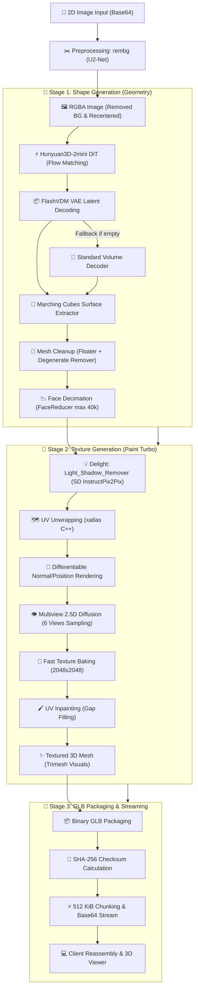

# 🧊 Hunyuan3D-2 Image-to-3D Pipeline & Serverless Architecture

Hệ thống dịch vụ chuyển đổi hình ảnh 2D thành mô hình 3D hoàn chỉnh kết cấu (Mesh + Texture GLB) dựa trên kiến trúc **Tencent Hunyuan3D-2** tối ưu hóa cho môi trường **Runpod Serverless Worker** (GPU NVIDIA L4 / RTX A5000 / RTX 3090 / 4090 24GB VRAM).

---

## 📐 1. Sơ đồ Tổng quan Luồng Xử lý (End-to-End Pipeline)



---

## 🔍 2. Chi tiết Từng Giai đoạn Xử lý

### 2.1. Tiền xử lý ảnh (Preprocessing & Background Removal)
- **Model**: `BackgroundRemover` (`u2net.onnx` qua ONNX Runtime).
- **Quy trình**:
  1. Giải mã chuỗi Base64 / Data URI thành ảnh PIL RGB.
  2. Tách đối tượng chính khỏi phông nền (Alpha matting).
  3. Cắt gọn biên thừa và căn giữa (`recenter_image`) trong khung vuông với viền đệm an toàn.

---

### 2.2. Sinh hình học 3D (Shape Generation)
- **Mô hình**: `tencent/Hunyuan3D-2mini` (subfolder: `hunyuan3d-dit-v2-mini-turbo`).
- **Cơ chế**:
  - **Diffusion Transformer (DiT) Flow Matching**: Sinh trường khoảng cách có hướng (SDF / Volume Latents) qua 5-30 bước lấy mẫu.
  - **FlashVDM (Fast Volume Decoding)**: Giải mã thể tích latent với độ phân giải phân cấp (Octree Resolution $256^3$).
  - **Marching Cubes Surface Extraction**: Trích xuất lưới đa giác (Vertices + Triangles) từ lưới mật độ thể tích.
  - **Cơ chế Tự phục hồi (Self-healing Fallback)**: Nếu FlashVDM sinh lưới rỗng (`empty mesh`), hệ thống tự động fallback về Standard Volume Decoder để đảm bảo job luôn trả về hình học hợp lệ.

---

### 2.3. Hậu xử lý & Tối ưu lưới (Mesh Post-processing)
- **FloaterRemover**: Quét và loại bỏ các đảo đa giác vụn vặt không liên kết với thân chính.
- **DegenerateFaceRemover**: Loại bỏ các tam giác diện tích bằng 0 hoặc các cạnh trùng lặp.
- **FaceReducer (`pymeshlab` Quadric Edge Collapse Decimation)**: Rút gọn số lượng mặt đa giác xuống mức an toàn (mặc định 40,000 faces), tối ưu hóa dung lượng file và độ mượt mà khi hiển thị trên Web/Three.js.

---

### 2.4. Sinh chất liệu & Tô màu (Texture Generation Pipeline)
Mô hình sử dụng: `tencent/Hunyuan3D-2` (subfolder: `hunyuan3d-paint-v2-0-turbo`).

1. **Khử bóng đổ (`Delight` / `Light_Shadow_Remover`)**:
   - Sử dụng mô hình `StableDiffusionInstructPix2PixPipeline` (fp16).
   - Loại bỏ các vùng bóng tối (shadows) và đốm sáng mạnh (specular highlights) từ ảnh 2D ban đầu nhằm trích xuất màu sắc Albedo/Diffuse thuần túy.
   - Có cơ chế dự phòng an toàn (safe fallback) tự động sử dụng ảnh gốc nếu việc khử bóng gặp sự cố.
2. **Trải UV tự động (`mesh_uv_wrap`)**:
   - Tận dụng thư viện C++ `xatlas.parametrize` để trải phẳng bề mặt 3D phức tạp lên không gian 2D texture coordinate ($U, V \in [0, 1]$).
3. **Chiếu góc máy vi sai (`Differentiable Renderer`)**:
   - Sử dụng `custom_rasterizer` (CUDA rasterization native module) kết hợp `MeshRender`.
   - Render Normal map và Position map cho 6 góc chụp xung quanh vật thể:
     - Góc phương vị (Azimuth): $[0^\circ, 90^\circ, 180^\circ, 270^\circ, 0^\circ, 180^\circ]$
     - Góc tà (Elevation): $[0^\circ, 0^\circ, 0^\circ, 0^\circ, 90^\circ, -90^\circ]$
4. **Khuếch tán đa góc nhìn (`Multiview_Diffusion_Net`)**:
   - `HunyuanPaintPipeline` (UNet 2.5D Condition Model + LCM Scheduler).
   - Lấy mẫu trong 3-5 bước turbo dựa trên các Normal/Position maps để sinh ra 6 bức ảnh nhìn từ 6 góc tương ứng với ánh sáng tự nhiên đồng nhất.
   - Tải trực tiếp trọng số qua định dạng `diffusion_pytorch_model.safetensors` (3.72 GB) tối ưu tốc độ và an toàn bộ nhớ.
5. **Bake Texture & Khử đường giáp ranh (`Fast Texture Baking`)**:
   - Chiếu ngược (back-project) 6 bức ảnh multiview lên UV canvas độ phân giải $2048 \times 2048$.
   - Hòa trộn trọng số cosin (`weighted cosine blending`) giúp loại bỏ hoàn toàn các vệt cắt góc chụp.
6. **Dặm vá lỗ khuất (`UV Inpainting`)**:
   - Dùng thuật toán Navier-Stokes inpainting để lấp kín các khe hẹp hoặc vùng khuất mà camera không chiếu tới.
7. **Gắn vật liệu (`Trimesh TextureVisuals`)**:
   - Gắn `SimpleMaterial` cùng ảnh texture 2048x2048 vào mesh 3D.

---

### 2.5. Đóng gói & Truyền phát (GLB Packaging & Streaming)
- Toàn bộ geometry và texture bitmap được pack vào file định dạng nhị phân `.glb`.
- Server tính toán mã băm `SHA-256` của file hoàn chỉnh.
- File được chia thành các chunk nhị phân $512\text{ KiB}$, mã hóa Base64 và truyền về client theo giao thức Runpod Serverless Generator (Streaming SSE).
- Client nhận các chunk, ghép lại và xác minh checksum `SHA-256` trước khi nạp vào Three.js Viewer.

---

## ⚡ 3. Chiến lược Quản lý Bộ nhớ & Tối ưu VRAM (Sequential Offload)

Để hạn chế tối đa nguy cơ **CUDA Out-Of-Memory (OOM)** trên các card đồ họa 24GB VRAM, hệ thống áp dụng kỹ thuật **GPU Lifecycle Pipeline**:

| Giai đoạn | Mô hình trên GPU | Bộ nhớ VRAM ước tính | Hành động sau bước |
| :--- | :--- | :--- | :--- |
| **1. Khởi tạo & Tiền xử lý** | CPU | ~0 MB GPU | Giữ VRAM trống hoàn toàn |
| **2. Shape Generation** | DiT + VAE (Hunyuan3D-2mini) | ~6.5 GB | Offload DiT về CPU, gọi `empty_cache()` |
| **3. Delight Processing** | SD InstructPix2Pix | ~3.5 GB | Offload Delight về CPU, gọi `empty_cache()` |
| **4. Multiview Diffusion** | UNet2.5D + CLIP (Paint Turbo) | ~6.0 GB (Peak ~14 GB) | Hưởng trọn 100% VRAM trống, offload về CPU |
| **5. Texture Baking** | Custom CUDA Rasterizer | ~2.5 GB | Giải phóng mesh và dọn dẹp cache |

---

## 📡 4. Giao thức Gọi API (API Contract)

### 4.1. Request Payload (`POST /run` hoặc `/runsync`)
```json
{
  "input": {
    "action": "generate3d",
    "image_base64": "data:image/png;base64,iVBORw0KGgo...",
    "octree_resolution": 256,
    "num_inference_steps": 5,
    "guidance_scale": 5.0,
    "face_count": 40000,
    "texture": true,
    "seed": 1234
  }
}
```

### 4.2. Stream Events (Gửi từ Worker về Client)
1. **Tiến độ (`progress`)**:
   ```json
   {"type": "progress", "stage": "shape_generation", "elapsed_ms": 1240, "vram": {"allocated_mb": 6120.5}}
   ```
2. **Metadata file GLB (`file_meta`)**:
   ```json
   {"type": "file_meta", "name": "model.glb", "size": 3450124, "chunks": 7, "sha256": "332537496c9d..."}
   ```
3. **Phân mảnh dữ liệu (`file_chunk`)**:
   ```json
   {"type": "file_chunk", "index": 0, "data": "Z2xURgIAAAB..."}
   ```
4. **Hoàn tất (`done`)**:
   ```json
   {
     "type": "done",
     "timings": {
       "preprocess_ms": 250,
       "shape_ms": 3200,
       "cleanup_ms": 800,
       "texture_ms": 8500,
       "export_ms": 400,
       "total_ms": 13150
     }
   }
   ```

---

## 🧪 5. Kiểm thử & Chạy thử Nghiệm

### 5.1. Chạy Unit Tests
```bash
python -m pytest test_handler.py -v
```
*(Bao gồm 15 unit tests kiểm thử độc lập cho từng luồng: shape generation, texture pipeline fallback, Base64 parser, chunking, sha256 checksum, v.v.)*

### 5.2. Chạy Giao diện Test Web Trực quan
Mở trực tiếp file [`test_local_serverless.html`](file:///f:/codingSpace/Asm/3d_hunyuan_be/test_local_serverless.html) trong trình duyệt để nhập **Runpod API Key** và **Endpoint ID**, kéo thả ảnh và xem 3D Mesh xoay 360 độ theo thời gian thực.
