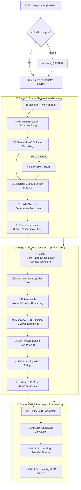

# 🧊 Hunyuan3D-2 Image-to-3D Pipeline & Serverless Architecture

Hệ thống dịch vụ chuyển đổi hình ảnh 2D thành mô hình 3D hoàn chỉnh kết cấu (Mesh + Texture GLB) dựa trên kiến trúc **Tencent Hunyuan3D-2** tối ưu hóa cho môi trường **Runpod Serverless Worker** (GPU NVIDIA L4 / RTX A5000 / RTX 3090 / 4090 24GB VRAM).

---

## 📐 1. Sơ đồ Tổng quan Luồng Xử lý (End-to-End Pipeline)



---

## 🔍 2. Chi tiết Từng Giai đoạn Xử lý

### Các lớp của Unified pipeline và ảnh hưởng dây chuyền

| Lớp | Mục đích | Dữ liệu chuyển sang lớp sau / ảnh hưởng tới 3D |
| :--- | :--- | :--- |
| NSFW (`analyze`) | Chặn ảnh không phù hợp trước khi dùng các model nặng | Nếu bị chặn, toàn bộ pipeline dừng. Nếu đạt, ảnh gốc đi tiếp; score không đổi shape. |
| BLIP (`caption`) | Tạo caption ngắn để LLaVA có thêm ngữ cảnh | Caption được ghép vào prompt của LLaVA; không được truyền vào Hunyuan3D. |
| LLaVA (`custom_describe`) | Sinh mô tả giàu thông tin cho API/người dùng | Trả `rich_prompt`; hiện chỉ là metadata, không điều khiển geometry hay texture. |
| Alpha/rembg + recenter | Tách silhouette, căn vật thể giữa khung 512×512 | Đây là đầu vào trực tiếp của shape model; mất tai/chân ở mask thì các lớp sau không thể khôi phục. PNG đã có alpha được giữ nguyên để tránh tách nền lần hai. |
| Shape DiT | Suy diễn latent 3D từ một ảnh | Quyết định cấu trúc lớn và các mặt khuất; seed, steps và guidance tác động tại đây. |
| VAE + Marching Cubes | Giải latent thành bề mặt tam giác | `octree_resolution` quyết định độ mịn không gian; không thể tạo lại chi tiết mà DiT không sinh. |
| Mesh cleanup | Bỏ mặt lỗi rồi giới hạn số face | Làm mesh ổn định cho texture; không tự xóa các component nhỏ có thể là tai, móng hoặc đuôi. |
| Texture pipeline | Trải UV, tạo sáu view, bake và inpaint màu | Chỉ đổi vật liệu/màu trên mesh có sẵn, không sửa hình học bị thiếu. |
| GLB export/stream | Đóng gói mesh + texture, checksum và chia chunk | Không đổi nội dung 3D; chỉ ảnh hưởng cách client nhận và kiểm tra file. |

Vì Hunyuan shape hiện là image-conditioned, `prompt`, BLIP và LLaVA không thể sửa một cái tai bị thiếu. Hai đầu vào quyết định trực tiếp nhất là silhouette sau tiền xử lý và checkpoint/seed của Shape DiT.

### 2.1. Tiền xử lý ảnh (Preprocessing & Background Removal)
- **Model**: `BackgroundRemover` (`u2net.onnx` qua ONNX Runtime).
- **Quy trình**:
  1. Giải mã chuỗi Base64 / Data URI thành ảnh PIL RGB hoặc RGBA.
  2. Nếu ảnh đã có alpha hợp lệ thì giữ nguyên; chỉ chạy tách nền khi ảnh còn đục hoàn toàn.
  3. Cắt gọn biên thừa và căn giữa (`recenter_image`) trong khung vuông với viền đệm an toàn.

---

### 2.2. Sinh hình học 3D (Shape Generation)
- **Mô hình mặc định**: `tencent/Hunyuan3D-2.1` (subfolder: `hunyuan3d-dit-v2-1`). Có thể ghi đè bằng `HUNYUAN_SHAPE_MODEL` và `HUNYUAN_SHAPE_SUBFOLDER`.
- **Cơ chế**:
  - **Diffusion Transformer (DiT) Flow Matching**: Mặc định dùng 50 bước lấy mẫu để ưu tiên độ trung thực hình học.
  - **Standard Volume Decoder**: Giải mã thể tích ở Octree Resolution $384^3$; FlashVDM chỉ tự bật khi cấu hình một checkpoint Turbo.
  - **Marching Cubes Surface Extraction**: Trích xuất lưới đa giác (Vertices + Triangles) từ lưới mật độ thể tích.
  - **Cơ chế Tự phục hồi (Self-healing Fallback)**: Nếu FlashVDM sinh lưới rỗng (`empty mesh`), hệ thống tự động fallback về Standard Volume Decoder để đảm bảo job luôn trả về hình học hợp lệ.

---

### 2.3. Hậu xử lý & Tối ưu lưới (Mesh Post-processing)
- **DegenerateFaceRemover**: Loại bỏ các tam giác diện tích bằng 0 hoặc các cạnh trùng lặp.
- **FaceReducer (`pymeshlab` Quadric Edge Collapse Decimation)**: Chỉ rút gọn mesh vượt quá 200,000 faces để giữ chi tiết hình học tốt hơn.

Unified worker không chạy `FloaterRemover`: bộ lọc này xem mọi component nhỏ hơn 0.5% số face là rác và có thể xóa nhầm chi tiết tách rời nhưng hợp lệ như tai hoặc móng.

---

### 2.4. Sinh chất liệu & Tô màu (Texture Generation Pipeline)
Mô hình sử dụng: `tencent/Hunyuan3D-2` (subfolder: `hunyuan3d-paint-v2-0-turbo`).

1. **Khử bóng đổ (`Delight` / `Light_Shadow_Remover`)**:
   - Sử dụng mô hình `StableDiffusionInstructPix2PixPipeline` (fp16).
   - Loại bỏ các vùng bóng tối (shadows) và đốm sáng mạnh (specular highlights) từ ảnh 2D ban đầu nhằm trích xuất màu sắc Albedo/Diffuse thuần túy.
   - Có cơ chế dự phòng an toàn (safe fallback) tự động sử dụng ảnh gốc nếu việc khử bóng gặp sự cố.
2. **Trải UV tự động (`mesh_uv_wrap`)**:
   - Tận dụng thư viện C++ `xatlas.parametrize` để trải phẳng bề mặt 3D phức tạp lên không gian 2D texture coordinate ($U, V \in [0, 1]$).
3. **Chiếu góc máy vi sai (`Differentiable Renderer`)**:
   - Sử dụng `custom_rasterizer` (CUDA rasterization native module) kết hợp `MeshRender`.
   - Render Normal map và Position map cho 6 góc chụp xung quanh vật thể:
     - Góc phương vị (Azimuth): $[0^\circ, 90^\circ, 180^\circ, 270^\circ, 0^\circ, 180^\circ]$
     - Góc tà (Elevation): $[0^\circ, 0^\circ, 0^\circ, 0^\circ, 90^\circ, -90^\circ]$
4. **Khuếch tán đa góc nhìn (`Multiview_Diffusion_Net`)**:
   - `HunyuanPaintPipeline` (UNet 2.5D Condition Model + LCM Scheduler).
   - Lấy mẫu 10 bước trên lịch distillation 30 bước của checkpoint, dựa trên các Normal/Position maps để sinh ra 6 bức ảnh nhìn từ 6 góc tương ứng với ánh sáng tự nhiên đồng nhất.
   - Tải trực tiếp trọng số qua định dạng `diffusion_pytorch_model.safetensors` (3.72 GB) tối ưu tốc độ và an toàn bộ nhớ.
5. **Bake Texture & Khử đường giáp ranh (`Fast Texture Baking`)**:
   - Chiếu ngược (back-project) 6 bức ảnh multiview lên UV canvas độ phân giải $2048 \times 2048$.
   - Hòa trộn trọng số cosin (`weighted cosine blending`) giúp loại bỏ hoàn toàn các vệt cắt góc chụp.
6. **Dặm vá lỗ khuất (`UV Inpainting`)**:
   - Dùng thuật toán Navier-Stokes inpainting để lấp kín các khe hẹp hoặc vùng khuất mà camera không chiếu tới.
7. **Gắn vật liệu (`Trimesh TextureVisuals`)**:
   - Gắn `SimpleMaterial` cùng ảnh texture 2048x2048 vào mesh 3D.

---

### 2.5. Đóng gói & Truyền phát (GLB Packaging & Streaming)
- Toàn bộ geometry và texture bitmap được pack vào file định dạng nhị phân `.glb`.
- Server tính toán mã băm `SHA-256` của file hoàn chỉnh.
- File được chia thành các chunk nhị phân $512\text{ KiB}$, mã hóa Base64 và truyền về client theo giao thức Runpod Serverless Generator (Streaming SSE).
- Client nhận các chunk, ghép lại và xác minh checksum `SHA-256` trước khi nạp vào Three.js Viewer.

---

## ⚡ 3. Chiến lược Quản lý Bộ nhớ & Tối ưu VRAM (Sequential Offload)

Để hạn chế tối đa nguy cơ **CUDA Out-Of-Memory (OOM)** trên các card đồ họa 24GB VRAM, hệ thống áp dụng kỹ thuật **GPU Lifecycle Pipeline**:

| Giai đoạn | Mô hình trên GPU | Bộ nhớ VRAM ước tính | Hành động sau bước |
| :--- | :--- | :--- | :--- |
| **1. Khởi tạo & Tiền xử lý** | CPU | ~0 MB GPU | Giữ VRAM trống hoàn toàn |
| **2. Shape Generation** | DiT + VAE (Hunyuan3D-2.1) | Phụ thuộc GPU/runtime | Offload DiT về CPU, gọi `empty_cache()` |
| **3. Delight Processing** | SD InstructPix2Pix | ~3.5 GB | Offload Delight về CPU, gọi `empty_cache()` |
| **4. Multiview Diffusion** | UNet2.5D + CLIP (Paint Turbo) | ~6.0 GB (Peak ~14 GB) | Hưởng trọn 100% VRAM trống, offload về CPU |
| **5. Texture Baking** | Custom CUDA Rasterizer | ~2.5 GB | Giải phóng mesh và dọn dẹp cache |

---

## 📡 4. API Reference

### 4.1. Runpod Serverless

Base URL: `https://api.runpod.ai/v2/{ENDPOINT_ID}`. Mọi request dùng header `Authorization: Bearer {RUNPOD_API_KEY}` và bọc tham số trong object `input`.

| Action | Mục đích | Input riêng | Output chính |
| :--- | :--- | :--- | :--- |
| `analyze` | Kiểm tra NSFW | — | Event `result` chứa scores và `is_nsfw` |
| `caption` | Tạo caption BLIP | `prompt`, `max_new_tokens`, `min_new_tokens` | Event `result` chứa `caption` |
| `custom_describe` | Phân tích ảnh bằng LLaVA | `prompt`, `model` | Event `result` chứa mô tả Việt/Anh |
| `generate3d` | Sinh shape, mesh và texture | Các tham số tại mục 4.2 | Chuỗi event và các chunk GLB |
| `pipeline` | Chạy toàn bộ bốn bước trên | `prompt` và các tham số shape | Kết quả phân tích, sau đó các chunk GLB |

Tất cả action yêu cầu `image_base64` hoặc alias `image`. Giá trị có thể là Base64 thuần hoặc data URI; dung lượng sau decode tối đa 25 MB. Nên dùng `POST /run` rồi đọc `GET /stream/{JOB_ID}` cho `generate3d` và `pipeline`; `/runsync` phù hợp hơn với các action chỉ trả JSON nhỏ.

```bash
curl -X POST "https://api.runpod.ai/v2/${ENDPOINT_ID}/run" \
  -H "Authorization: Bearer ${RUNPOD_API_KEY}" \
  -H "Content-Type: application/json" \
  -d '{"input":{"action":"analyze","image_base64":"iVBORw0KGgo..."}}'
```

### 4.2. `generate3d`

| Field | Kiểu | Bắt buộc | Mặc định | Ý nghĩa |
| :--- | :--- | :---: | :--- | :--- |
| `action` | string | Có | — | Phải là `generate3d` |
| `image_base64` / `image` | string | Có | — | Ảnh nguồn Base64 hoặc data URI |
| `seed` | integer | Không | `1234` | Seed tái lập kết quả |
| `octree_resolution` | integer | Không | `384` | Độ phân giải giải mã thể tích; tăng giá trị làm tăng thời gian và VRAM |
| `num_inference_steps` | integer | Không | `50` | Số bước lấy mẫu shape; mặc định là `5` nếu worker được cấu hình với checkpoint Turbo |
| `guidance_scale` | number | Không | `5.0` | Mức bám theo ảnh nguồn |
| `face_count` | integer | Không | `200000` | Số faces tối đa sau decimation |
| `texture` | boolean | Không | `true` | `false` trả mesh trắng, bỏ qua texture pipeline |

```json
{
  "input": {
    "action": "generate3d",
    "image_base64": "data:image/png;base64,iVBORw0KGgo...",
    "octree_resolution": 384,
    "num_inference_steps": 50,
    "guidance_scale": 5.0,
    "face_count": 200000,
    "texture": true,
    "seed": 1234
  }
}
```

`texture_resolution` chưa phải tham số có hiệu lực của worker; texture pipeline hiện dùng cấu hình nội bộ 2048 px.

### 4.3. Stream events và file GLB

Worker phát các object sau theo thứ tự:

1. Tiến độ: `{"type":"progress","stage":"shape_generation","elapsed_ms":1240,"vram":{"allocated_mb":6120.5}}`
2. Metadata: `{"type":"file_meta","name":"model.glb","size":3450124,"chunks":7,"sha256":"332537496c9d..."}`
3. Một hoặc nhiều chunk: `{"type":"file_chunk","index":0,"data":"Z2xURgIAAAB..."}`
4. Hoàn tất: `{"type":"done","timings":{"shape_ms":3200,"cleanup_ms":800,"texture_ms":8500,"total_ms":13150}}`

Sắp xếp `file_chunk` theo `index`, decode Base64 rồi nối byte; kiểm tra kích thước và SHA-256 bằng event `file_meta`. Khi thất bại worker phát `{"type":"error","stage":"execution","error":"...","timings":{"total_ms":100}}` thay vì file.

Các stage chính của `generate3d`: `decode_input`, `worker_init`, `preprocess`, `shape_generation`, `mesh_cleanup`, `loading_texture_pipeline`, `texture_generation`, `glb_export`. Với action `pipeline`, stage được thêm prefix `moderation.`, `caption.`, `analysis.` hoặc `generate3d.`.

### 4.4. Unified pipeline trên Runpod

```json
{
  "input": {
    "action": "pipeline",
    "image_base64": "data:image/png;base64,iVBORw0KGgo...",
    "prompt": "Phân tích vật liệu và hình khối để dựng 3D",
    "octree_resolution": 384,
    "num_inference_steps": 50,
    "face_count": 200000
  },
  "policy": {
    "executionTimeout": 1200000,
    "ttl": 1800000
  }
}
```

Luồng xử lý là `NSFW → BLIP → LLaVA → Hunyuan3D`. Texture luôn được bật cho action này; ảnh NSFW tạo event `error` ở stage `moderation` và dừng trước các model còn lại.

### 4.5. Local Gateway

Base URL mặc định: `http://127.0.0.1:4000`. FastAPI cung cấp Swagger UI tại `/docs`.

| Method | Path | Input | Response |
| :--- | :--- | :--- | :--- |
| `GET` | `/health` | — | `{"ok":true}` |
| `POST` | `/analyze` | multipart `image` | JSON kết quả NSFW |
| `POST` | `/caption` | multipart `image`; form `prompt`, `max_new_tokens`, `min_new_tokens` | JSON caption |
| `POST` | `/custom_describe` | multipart `image`; form `prompt` | JSON mô tả |
| `POST` | `/generate3d` | multipart `image` | Binary `model/gltf-binary` |
| `POST` | `/pipeline/process-all` | JPEG/PNG multipart `image` ≤ 20 MB; form `prompt` tùy chọn | JSON chứa `task_id` và `glb_url` |
| `GET` | `/pipeline/result/{task_id}.glb` | UUID từ pipeline | Binary GLB |

`/generate3d` của local gateway chưa expose các tham số quality; nó dùng mặc định của backend 3D. Pipeline đầy đủ:

```bash
curl -X POST http://127.0.0.1:4000/pipeline/process-all \
  -F "image=@chair.png" \
  -F "prompt=Phân tích vật liệu và hình khối để dựng 3D"
```

```json
{
  "ok": true,
  "task_id": "936da01f-9abd-4d9d-80c7-02af85c822a8",
  "results": {
    "moderation": {"ok": true, "is_nsfw": false},
    "description": {"caption": "a wooden chair"},
    "rich_prompt": "Ghế gỗ sồi, bốn chân tròn",
    "model_3d": {
      "status": "success",
      "glb_url": "/pipeline/result/936da01f-9abd-4d9d-80c7-02af85c822a8.glb"
    }
  }
}
```

Các lỗi gateway thường gặp: `400` ảnh rỗng hoặc bị chặn NSFW, `413` quá 20 MB, `415` không phải JPEG/PNG, `404` không tìm thấy GLB và `502` service phía sau lỗi.

---

## 🧪 5. Kiểm thử & Chạy thử Nghiệm

### 5.1. Chạy Unit Tests
```bash
python -m pytest test_handler.py test_gateway.py -v
```
*(Bao gồm 24 unit tests cho worker, model preload, unified gateway, texture fallback, Base64, chunking và checksum.)*

### 5.2. Chạy Giao diện Test Web Trực quan
Mở trực tiếp file [`test_local_serverless.html`](file:///f:/codingSpace/Asm/3d_hunyuan_be/test_local_serverless.html) trong trình duyệt để nhập **Runpod API Key** và **Endpoint ID**, kéo thả ảnh và xem 3D Mesh xoay 360 độ theo thời gian thực.
